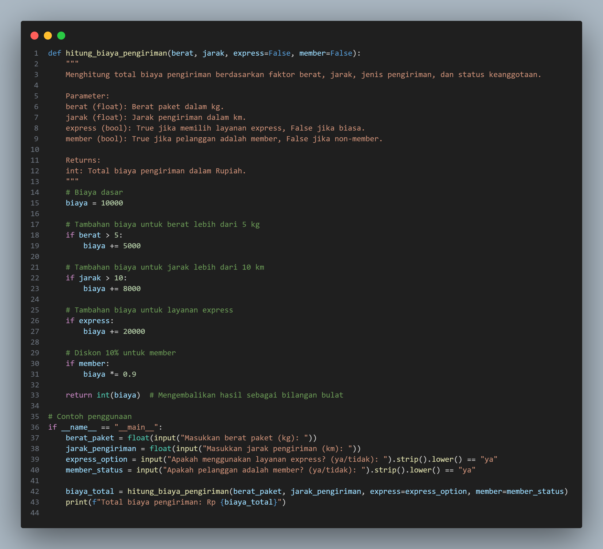
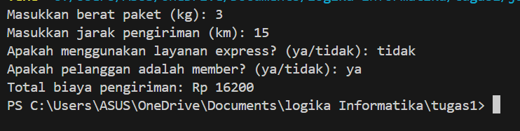

# Hitung Biaya Pengiriman

# Data Diri
Nama: Diva Zahrotunnisa

NIM: 312410415

Kelas: TI.24.A3

## Deskripsi
Program ini digunakan untuk menghitung total biaya pengiriman berdasarkan beberapa faktor, yaitu:
1. **Berat paket** dalam kilogram (kg)
2. **Jarak pengiriman** dalam kilometer (km)
3. **Jenis pengiriman**, apakah pengiriman biasa atau express
4. **Status keanggotaan pelanggan**, apakah pelanggan merupakan member atau bukan

Biaya pengiriman dihitung berdasarkan aturan berikut:
- **Biaya dasar** pengiriman: **Rp 10.000**
- Jika berat paket melebihi **5 kg**, dikenakan tambahan biaya **Rp 5.000**
- Jika jarak pengiriman lebih dari **10 km**, dikenakan tambahan biaya **Rp 8.000**
- Jika pelanggan memilih layanan **express**, dikenakan tambahan biaya **Rp 20.000**
- Jika pelanggan adalah **member**, diberikan **diskon 10%** dari total biaya sebelum diskon

## Fitur
- Menghitung total biaya pengiriman secara otomatis berdasarkan input pengguna
- Mendukung layanan **express** untuk pengiriman lebih cepat
- Memberikan **diskon 10%** bagi pelanggan yang merupakan **member**
- Program berjalan secara **interaktif** melalui terminal atau command prompt

## Persyaratan
Program ini memerlukan **Python 3.x** untuk dijalankan. Pastikan Python telah terinstal di sistem Anda.

## input & output

## input

## output

# logikainformatika
